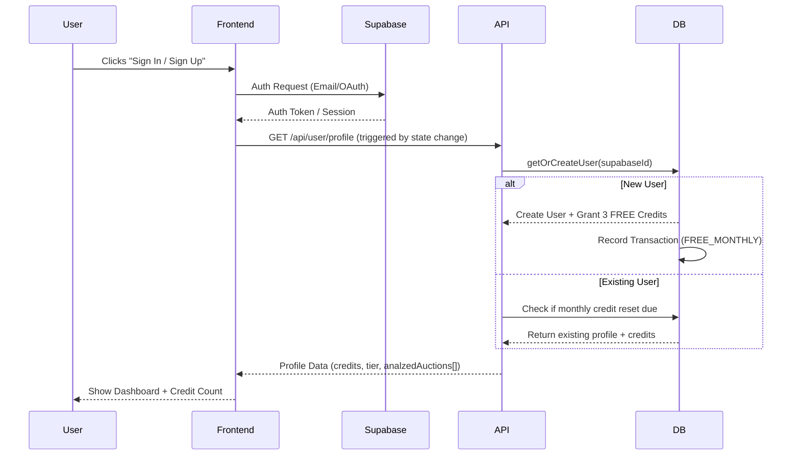
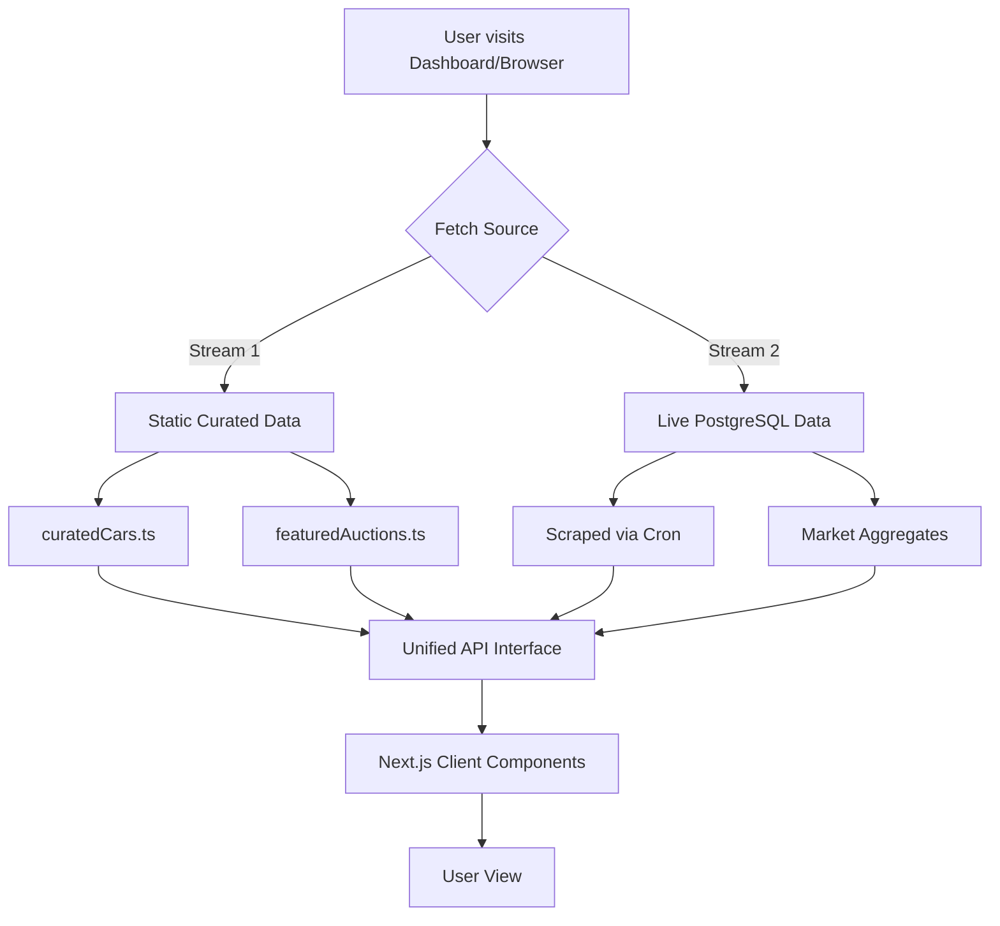
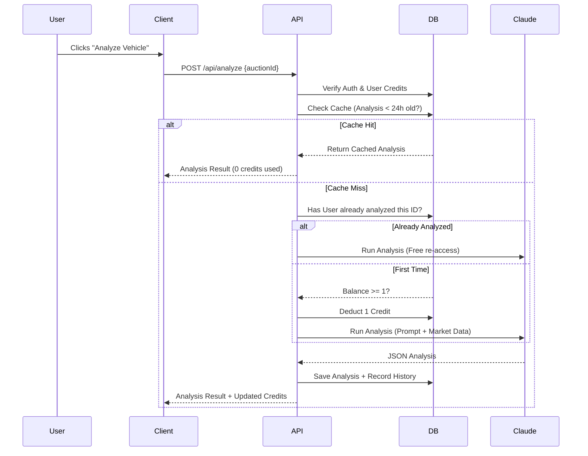

# 🌊 Monza Lab — User & Data Flows

This document outlines the core operational flows of the Monza Lab platform, detailing how data moves from external auction platforms to the user's screen through our AI analysis engine.

---

## 1. User Authentication & Onboarding
How a new user enters the ecosystem and receives their starting analysis credits.



---

## 2. Auction Discovery Flow
Monza uses a "Dual-Stream" data strategy to ensure the app is never empty.



---

## 3. AI Analysis & Credit Flow
The "Brain" of the operation. This flow manages cost-intensive AI calls through caching and credits.



---

## 4. Automatic Data Ingestion (The Cron)
How the system stays fresh without manual intervention.

```mermaid
graph LR
    Trigger[Vercel Cron Trigger] --> API[/api/cron]
    API -->|Auth: Bearer Token| ScraperMgr[Scraper Manager]
    
    subgraph Platforms
        ScraperMgr --> BaT[Bring a Trailer Scraper]
        ScraperMgr --> CB[Cars & Bids Scraper]
        ScraperMgr --> CC[Collecting Cars Scraper]
    end
    
    BaT & CB & CC -->|Raw JSON| DBUpdate[Upsert to DB]
    DBUpdate --> History[Record Price History]
    History --> Calc[Recalculate MarketData]
    Calc -->|Avg/Low/High| FinalDB[(PostgreSQL)]
```

---

## 5. Search & Filtering Logic
How users find specific investment-grade assets.

1.  **Query Input**: User types in Search Bar (debounced 300ms).
2.  **API Routing**: Request hits `/api/auctions?q=...&make=...&year=...`.
3.  **Unified Search**:
    *   Search `CURATED_CARS` array (high performance, client-ready).
    *   Search `PostgreSQL` using Prisma `contains` & `insensitive` filters.
4.  **Ranking**: 
    *   Priority 1: Matches in Curated list.
    *   Priority 2: Live matches sorted by `endTime` (Ending Soonest).
5.  **Render**: Results mapped to common `AuctionCard` components.

---

## 6. Credit Reset Engine (Internal)
Monza operates on a freemium model.

*   **Frequency**: Monthly.
*   **Trigger**: User profile access (Lazy Reset).
*   **Logic**: 
    *   If `currentDate` > `creditResetDate`:
    *   Set `creditsBalance` = 3 (Free Tier).
    *   Set `creditResetDate` = `currentDate + 1 month`.
    *   Log `TransactionType.FREE_MONTHLY`.
